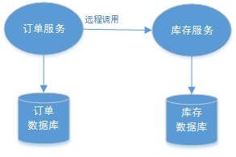
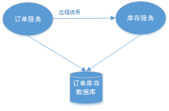
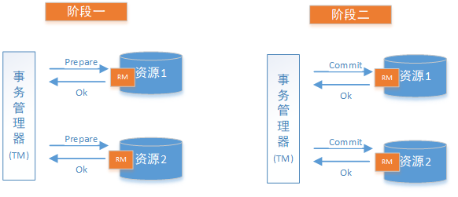
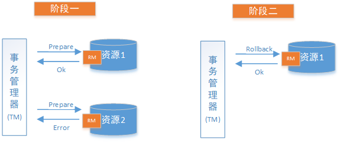
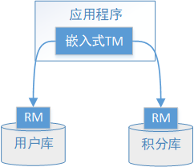
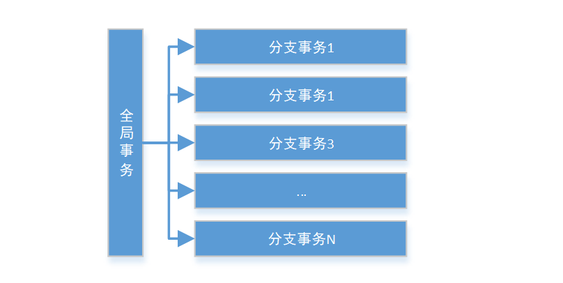
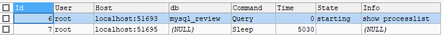
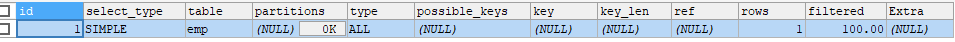
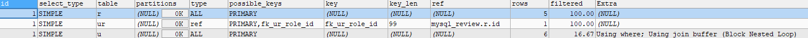

# 面试题汇总
## 分布式唯一ID的生成方案有哪些？
| 方案 | 描述 | 优点 | 缺点 |
| :------| :------: | :------ | :------ |
| UUID | UUID是通用的唯一标识的缩写,它的目的是让分布式系统中的所<br>有元素都唯一的辨识信息，而不是需要中央控制器来指定唯一标<br>识| 1.降低了全军节点的压力，是的主键生成的速度更加的快<br>2.生成的主键全局唯一<br>3.跨服务合并方便 |1. UUID占用16个字符，空间占用比较大<br>2.不是递增性的，数据写入IO随机性很大，且索引效率下降 |
| 数据库主键自增 | MySQL数据库设置主键且主键自动增长 | 1. INT和BIGINT类型占用空间较小<br>2.主键自动增长，IO写入连续性好<br>3.数字类型查询速度优于字符串 |1. 并发性能不高，受限于数据库性能，<br>2.分库，分表，需要改造，复杂<br>3.自增，数据和数据量泄露 |
|  Redis自增 | Redis计数器，原子性自增  | 使用内存，并发性好  |1. 数据丢失，2.自增：数据量泄露  |
|雪花算法| 雪花算法是分布式ID的经典解决方案| 1. 不依赖外部组件，<br>2.性能好 | 时钟回拨|

```text
此处主要推荐使用雪花算法来作为全局唯一ID的方案，雪花算法的全局唯一ID主要有一下几个部分组成：
1. 符号位占1位
2. 时间戳占41位
3. 随机ID占10位
4. 序列号占12位，一毫秒可以生产4095个ID
```

## 使用分布式锁的场景
```text
1. 系统是一个分布式系统，集群，java自带的锁在这种情况下无法处理这个问题
2. 操作共享资源，比如库里唯一的用户数据
3. 同步访问，即多个线程操作共享资源
```

### 分布式锁的解决方案
```text
1. Redis分布式锁，是基于Redis做扩展开发，setnx key vakue expire 
 如果自己写需要考虑锁的时效性(程序突然挂了，但是锁没释放)，锁的设置和过期时间要是原子性的，watchdog(保证不会因为程序执行太长)

2. 基于zookeeper，临时节点，顺序节点

3. 基于数据库，比如MySql主键唯一索引的唯一性
```

### Redis做分布式锁死锁的情况，如何解决
```text
情况1. 加了锁，但是没有加释放锁的操作，如delete key

情况2. 加锁后，程序还没有执行释放锁，程序挂了，需要使用key过期时间
```

### 计数器算法
```text
技术器算法，是指在指定的时间周期内累加访问的次数，达到设定的阈值时，触发的限流策略。下一个时间周期 进行访问，
访问的次数清零，这个算法无论在三级还是分布式环境下实现都非常地简单，使用redis的incr原子自增性，再结合key的过期
时间，即可轻松的实现。
```

### 滑动窗口算法
```text
为了解决计数器算法临界值的问题，发明了滑动窗口算法。在TCP网络通信协议中，就采用滑动时间窗口算法来解决网络拥堵的问题。、
滑动时间窗口将计数器算法中的实际周期切分成多个小的时间窗口，分贝在每个小的时间窗口中记录访问次数，然后根据时间将窗口往前滑动并删除国企的小
时间窗口。最终只需要统计滑动窗口范围内的小时间串口的总的请求的即可。
阿里的sentinel就是使用滑动时间窗口的例子

```
[sentinel](./files/sentinel-dashboard-1.8.2.jar)

启动脚本
```text
java -Dserver.port=8080 -Dcsp.sentinel.dashboard.server=localhost:8080 -Dproject.name=sentinel-dashboard -jar sentinel-dashboard-1.8.2.jar
```


## 设计微服务时遵守的原则
```text
1. 单一职责原则:让每个服务独立，有界限的工作，每个服务只关注自己的业务。做到高内聚。

2. 服务自治原则:服务自治原则:每个服务都要做到独立的开发，独立测试，独立构建，独立部署，独立运行。与其他服务进行解耦

3. 轻量级的通信原则:让每个服务之间的调用轻量级，并且能够跨平台，跨语言。比如RESTful风格。利用消息队列进行通信等。

4. 粒度进化原则:对每个服务的粒度把控，其实没有统一的标准，这个的结合我们解决的具体业务问题，不要过度的设计
```

## 分布式事务
分布式系统会把一个应用拆分成为可以独立部署运行的多个服务，因此需要服务和服务之间协作才可以完成事务操作，这种分布式系统环境下由不同的服务
之间通过网络协作完成事务称之为**分布式事务**。


### 分布式事务产生的场景
1、典型的场景就是微服务架构 微服务之间通过远程调用完成事务操作。 比如：订单微服务和库存微服务，下单的
   同时订单微服务请求库存微服务减库存。 简言之：跨JVM进程产生分布式事务。


2、单体系统访问多个数据库实例 当单体系统需要访问多个数据库（实例）时就会产生分布式事务。 比如：用户信
息和订单信息分别在两个MySQL实例存储，用户管理系统删除用户信息，需要分别删除用户信息及用户的订单信
息，由于数据分布在不同的数据实例，需要通过不同的数据库链接去操作数据，此时产生分布式事务。 简言之：跨
数据库实例产生分布式事务。


3、多服务访问同一个数据库实例 比如：订单微服务和库存微服务即使访问同一个数据库也会产生分布式事务，原
因就是跨JVM进程，两个微服务持有了不同的数据库链接进行数据库操作，此时产生分布式事务。



### 分布式事务的基础理论的CAP
一.C - Consistency：
一致性是指写操作后的读操作可以读取到最新的数据状态，当数据分布在多个节点上，从任意结点读取到的数据都
是最新的状态。
上图中，商品信息的读写要满足一致性就是要实现如下目标：
1、商品服务写入主数据库成功，则向从数据库查询新数据也成功。
2、商品服务写入主数据库失败，则向从数据库查询新数据也失败。
如何实现一致性？
1、写入主数据库后要将数据同步到从数据库。
2、写入主数据库后，在向从数据库同步期间要将从数据库锁定，待同步完成后再释放锁，以免在新数据写入成功
后，向从数据库查询到旧的数据。

分布式系统一致性的特点：
1、由于存在数据同步的过程，写操作的响应会有一定的延迟。
2、为了保证数据一致性会对资源暂时锁定，待数据同步完成释放锁定资源。
3、如果请求数据同步失败的结点则会返回错误信息，一定不会返回旧数据。

二.A - Availability:
可用性是指任何事务操作都可以得到响应结果，且不会出现响应超时或响应错误。
上图中，商品信息读取满足可用性就是要实现如下目标：
1、从数据库接收到数据查询的请求则立即能够响应数据查询结果。
2、从数据库不允许出现响应超时或响应错误。
如何实现可用性？
1、写入主数据库后要将数据同步到从数据库。
2、由于要保证从数据库的可用性，不可将从数据库中的资源进行锁定。
3、即时数据还没有同步过来，从数据库也要返回要查询的数据，哪怕是旧数据，如果连旧数据也没有则可以按照
约定返回一个默认信息，但不能返回错误或响应超时。
分布式系统可用性的特点：
1、 所有请求都有响应，且不会出现响应超时或响应错误。

三.P - Partition tolerance ：
通常分布式系统的各各结点部署在不同的子网，这就是网络分区，不可避免的会出现由于网络问题而导致结点之间
通信失败，此时仍可对外提供服务，这叫分区容忍性。
上图中，商品信息读写满足分区容忍性就是要实现如下目标：
1、主数据库向从数据库同步数据失败不影响读写操作。
2、其一个结点挂掉不影响另一个结点对外提供服务。
如何实现分区容忍性？
1、尽量使用异步取代同步操作，例如使用异步方式将数据从主数据库同步到从数据，这样结点之间能有效的实现
松耦合。
2、添加从数据库结点，其中一个从结点挂掉其它从结点提供服务。
分布式分区容忍性的特点：
1、分区容忍性分是布式系统具备的基本能力。

* CAP理论的特性
如果要实现C则必须保证数据一致性，在数据同步的时候为防止向从数据库查询不一致的数据则需要将从数据库数
据锁定，待同步完成后解锁，如果同步失败从数据库要返回错误信息或超时信息。
如果要实现A则必须保证数据可用性，不管任何时候都可以向从数据查询数据，则不会响应超时或返回错误信息。
通过分析发现在满足P的前提下C和A存在矛盾性。

1）AP(追求最终一致性)：
放弃一致性，追求分区容忍性和可用性。这是很多分布式系统设计时的选择。

2）CP(追求强一致性)：
放弃可用性，追求一致性和分区容错性，我们的zookeeper其实就是追求的强一致，又比如跨行转账，一次转账请
求要等待双方银行系统都完成整个事务才算完成。
3)CA(放弃分区容忍性，这样就不是标准的分布式服务了)：
放弃分区容忍性，即不进行分区，不考虑由于网络不通或结点挂掉的问题，则可以实现一致性和可用性。那么系统
将不是一个标准的分布式系统，我们最常用的关系型数据就满足了CA。

通过上面我们已经学习了CAP理论的相关知识，CAP是一个已经被证实的理论：一个分布式系统最多只能同时满足
一致性（Consistency）、可用性（Availability）和分区容忍性（Partition tolerance）这三项中的两项。它可以作
为我们进行架构设计、技术选型的考量标准。对于多数大型互联网应用的场景，结点众多、部署分散，而且现在的
集群规模越来越大，所以节点故障、网络故障是常态，而且要保证服务可用性达到N个9（99.99..%），并要达到良
好的响应性能来提高用户体验，因此一般都会做出如下选择：保证P和A，舍弃C强一致，保证最终一致性。

### BASE理论
1、理解强一致性和最终一致性
CAP理论告诉我们一个分布式系统最多只能同时满足一致性（Consistency）、可用性（Availability）和分区容忍
性（Partition tolerance）这三项中的两项，其中AP在实际应用中较多，AP即舍弃一致性，保证可用性和分区容忍
性，但是在实际生产中很多场景都要实现一致性，比如前边我们举的例子主数据库向从数据库同步数据，即使不要
一致性，但是最终也要将数据同步成功来保证数据一致，这种一致性和CAP中的一致性不同，CAP中的一致性要求
在任何时间查询每个结点数据都必须一致，它强调的是强一致性，但是最终一致性是允许可以在一段时间内每个结
点的数据不一致，但是经过一段时间每个结点的数据必须一致，它强调的是最终数据的一致性。
2、Base理论介绍
BASE 是 Basically Available(基本可用)、Soft state(软状态)和 Eventually consistent (最终一致性)三个短语的缩
写。BASE理论是对CAP中AP的一个扩展，通过牺牲强一致性来获得可用性，当出现故障允许部分不可用但要保证
核心功能可用，允许数据在一段时间内是不一致的，但最终达到一致状态。满足BASE理论的事务，我们称之为“柔
性事务”。
基本可用:分布式系统在出现故障时，允许损失部分可用功能，保证核心功能可用。如，电商网站交易付款出
现问题了，商品依然可以正常浏览。
软状态:由于不要求强一致性，所以BASE允许系统中存在中间状态（也叫软状态），这个状态不影响系统可用
性，如订单的"支付中"、“数据同步中”等状态，待数据最终一致后状态改为“成功”状态。
最终一致:最终一致是指经过一段时间后，所有节点数据都将会达到一致。如订单的"支付中"状态，最终会变
为“支付成功”或者"支付失败"，使订单状态与实际交易结果达成一致，但需要一定时间的延迟、等待。


### 2PC
### 2PC协议的定义
2PC即两阶段提交协议，是将整个事务流程分为两个阶段，准备阶段（Prepare phase）、提交阶段（commit
phase），2是指两个阶段，P是指准备阶段，C是指提交阶段。
在计算机中部分关系数据库如Oracle、MySQL支持两阶段提交协议，如下图：
1. 准备阶段（Prepare phase）：事务管理器给每个参与者发送Prepare消息，每个数据库参与者在本地执行事
务，并写本地的Undo/Redo日志，此时事务没有提交。
（Undo日志是记录修改前的数据，用于数据库回滚，Redo日志是记录修改后的数据，用于提交事务后写入数
据文件）
2. 提交阶段（commit phase）：如果事务管理器收到了参与者的执行失败或者超时消息时，直接给每个参与者
发送回滚(Rollback)消息；否则，发送提交(Commit)消息；参与者根据事务管理器的指令执行提交或者回滚操
作，并释放事务处理过程中使用的锁资源。注意:必须在最后阶段释放锁资源。
下图展示了2PC的两个阶段，分成功和失败两个情况说明：





### 2PC的解决方案之XA方案
2PC的传统方案是在数据库层面实现的，如Oracle、MySQL都支持2PC协议，为了统一标准减少行业内不必要的对
接成本，需要制定标准化的处理模型及接口标准，国际开放标准组织Open Group定义了分布式事务处理模型
DTP（Distributed Transaction Processing Reference Model）。




DTP模型定义如下角色：
AP(Application Program)：即应用程序，可以理解为使用DTP分布式事务的程序。
RM(Resource Manager)：即资源管理器，可以理解为事务的参与者，一般情况下是指一个数据库实例，通过
资源管理器对该数据库进行控制，资源管理器控制着分支事务。
TM(Transaction Manager)：事务管理器，负责协调和管理事务，事务管理器控制着全局事务，管理事务生命
周期，并协调各个RM。全局事务是指分布式事务处理环境中，需要操作多个数据库共同完成一个工作，这个
工作即是一个全局事务。
DTP模型定义TM和RM之间通讯的接口规范叫XA，简单理解为数据库提供的2PC接口协议，基于数据库的XA
协议来实现2PC又称为XA方案。
以上三个角色之间的交互方式如下：
1）TM向AP提供 应用程序编程接口，AP通过TM提交及回滚事务。
2）TM交易中间件通过XA接口来通知RM数据库事务的开始、结束以及提交、回滚等。

执行流程如下：
1、应用程序（AP）持有用户库和积分库两个数据源。
2、应用程序（AP）通过TM通知用户库RM新增用户，同时通知积分库RM为该用户新增积分，RM此时并未提交事
务，此时用户和积分资源锁定。
3、TM收到执行回复，只要有一方失败则分别向其他RM发起回滚事务，回滚完毕，资源锁释放。
4、TM收到执行回复，全部成功，此时向所有RM发起提交事务，提交完毕，资源锁释放。


总结：
整个2PC的事务流程涉及到三个角色AP、RM、TM。AP指的是使用2PC分布式事务的应用程序；RM指的是资
源管理器，它控制着分支事务；TM指的是事务管理器，它控制着整个全局事务。
1）在准备阶段RM执行实际的业务操作，但不提交事务，资源锁定；
2）在提交阶段TM会接受RM在准备阶段的执行回复，只要有任一个RM执行失败，TM会通知所有RM执行回滚操
作，否则，TM将会通知所有RM提交该事务。提交阶段结束资源锁释放。
XA方案的问题：
1、需要本地数据库支持XA协议。
2、资源锁需要等到两个阶段结束才释放，性能较差。

#### 2PC提交的缺点
```text
1. 同步阻塞问题。执行的 过程中，所有参与者节点都是事务阻塞型的。当参与者占有公共资源和的时候，其他第三方节点访问公共资源不得不处于
阻塞状态。(1pc 准备节点，只是执行下SQL，而不提交并且占用数据库连接资源)

2. 单点问题。由于协调者的作用非常重要。一旦协调者挂掉了，参与者会一直阻塞下。尤其使在第二阶段，协调者发生故障，那么所有的参与者都
处于锁定状态中，而无法继续完成事务操作。(如果协调者挂掉，可以重新选举一个协调者，但是无法解决因为协调者当即导致的参与者处于阻塞状
态的问题)


```
### Seata方案

Seata是由阿里中间件团队发起的开源项目 Fescar，后更名为Seata，它是一个是开源的分布式事务框架。
传统2PC的问题在Seata中得到了解决，它通过对本地关系数据库的分支事务的协调来驱动完成全局事务，是工作
在应用层的中间件。主要优点是性能较好，且不长时间占用连接资源，它以高效并且对业务0侵入的方式解决微服
务场景下面临的分布式事务问题，它目前提供AT模式(即2PC)及TCC模式的分布式事务解决方案。
Seata的


Seata的设计思想如下：

2PC方案面临的问题。
Seata把一个分布式事务理解成一个包含了若干分支事务的全局事务。全局事务的职责是协调其下管辖的分支事务
达成一致，要么一起成功提交，要么一起失败回滚。此外，通常分支事务本身就是一个关系数据库的本地事务，下
图是全局事务与分支事务的关系图：
与.




## MySQL


### B tree与B+tree
```text
BTree又叫多路平衡搜索树，一颗m叉的BTree特征如下:
1. 书中每个节点最多包含m个孩子
2. 除根节点之外，每个节点至少又ceil(m/2)个孩子
3. 若根节点不是叶子节点，则至少又两个孩子
4. 所有的叶子节点都再同一层.
5.每个非叶子节点有n个key与n+1个指针组成,其中ceil(m/2)<=n<=m-1
------------------------------------------------------------------

B+tree是Btree的变种，B+tree的区别:
1. n叉B+tree最多含有n个key,而Btree最多含有n-1个key
2. B+tree的叶子节点保存所有的key信心，依key大小顺序排列
3. 所有的非叶子节点都可以看作是key的所以部分


```

### 索引的分类
```text
1. 主键索引
一个表的主键所谓索引
2. 单值索引
即一个索引只包含单个列，一个表可以包含多个单值索引
3. 唯一索引
索引的值必须是唯一的，可以为空值

4. 符合索引
复合索引:即一个索引包含多个列
```

### 索引的语法
```text
1. 创建表结构的时候指定索引
CREATE TABLE person(
id BIGINT PRIMARY KEY,
`name` VARCHAR(128) NOT NULL,
UNIQUE INDEX(`name`)
);


2. 创建好表之后再去创建索引
ALTER TABLE `person` ADD FULLTEXT idx_name(`name`);
```

### 索引设计得原则
```text
1. 对查询频次比较高的，且数据量比较达的表简历索引
2. 索引字段的选择，最佳的列应该是从where子句的条件中提取，如果where子句中的组合比较多，那莪应该提挑选最常用的，过滤效果最好的组合。
3. 使用唯一索引，区分度越高，使用索引的效率越高。
4. 索引可以有效的提升查询数据的效率，但是索引数据列不是多多益善，索引越多，维护索引的待加自然也是越大。对于插入，更新，删除等DML
操作比较频繁的表来说，索引过多，会引入相当高的维护代价，降低DML操作的效率，增加响应操作的时间消耗。另外索引过多的话，MYSQL会犯选择
困难症。
5. 使用短索引，索引创建之后也是使用硬盘来存储的，因此提升索引方位的I/O效率，也可以提升欧洲那个题的访问效率，如果索引的长度比较短，那么
相同的磁盘可以存储更多的索引，相应的可以提升MySQL访问索引的I/O效率。
6. 利用最左前缀

```

### 存储过程
```text
存储过程和函数是实现警告编辑并存储在数据库中的一段SQL语句的集合，调用存储过程和函数可以简化应用开发人员的很多工作，减少数据在数据库
和应用服务器之间的传输，对于提高数据处理的效率是有好处的。
存储函数:是一个有返回值的过程
存储过程:时一个没有返回值的函数

```
```sql
DELIMITER $ #此处需要些存储过程的分隔符
CREATE PROCEDURE p_name()
BEGIN	
SELECT 'hello mysql';#mysql默认的分号结束分隔符
END $ #提示sql执行分隔符
DELIMITER ;

-- 调用存储过程
CALL p_name();
-- 查询存储过程
SELECT NAME FROM mysql.`proc`;

SHOW PROCEDURE STATUS;

-- 查看存储过程的定义
SHOW CREATE PROCEDURE p_name;


-- 删除存储过程
DROP PROCEDURE p_name;
```

### 触发器
```text
触发器市与表有关的数据库对象，指在insert/update/delete之前或者之后，出发并执行定义中定义的SQL语句集合。触发器的这种特征可以协助应用在
数据库端确保数据的完整性，日志记录，数据校验等操作。
```
使用别名OLD和NEW来引用触发器中发生变化的记录内容，这与其他的数据库相似。现在触发器还指支持行级出发，不支持语句触发。

| 触发器类型 | NEW和OLD的使用 |
| :------| :------: |
|INSERT型触发器|NEW表示将要或者已经新增的数据|
|UPDATE型触发器|OLD表示修改之前的数据，NEW表示将要或者已经修改后的数据|
|DELETE型触发器|OLD表示将要或者已经删除的数据|

#### 触发器创建
```sql
create trigger trigger_name
before/after insert/update/delete
on table_name
[for each row] -- 触发行级触发器
begin


end $


CREATE TABLE emp_logs(
id INT(11) PRIMARY KEY AUTO_INCREMENT,
operation VARCHAR(32) NULL COMMENT '操作类型，insert/update/delete',
operate_time DATETIME NOT NULL COMMENT '操作时间',
operate_id INT(11) NOT NULL COMMENT '操作表id',
operate_params VARCHAR(500) COMMENT '操作参数'
);


CREATE TABLE emp(id INT(11) PRIMARY KEY AUTO_INCREMENT,
`name` VARCHAR(32),
age INT,
salary DECIMAL
);


DELIMITER $
CREATE TRIGGER emp_insert_trigger
AFTER INSERT
ON emp
FOR EACH ROW -- 申明是行级触发器
BEGIN
INSERT INTO emp_logs(id ,operation,operate_time,operate_id,operate_params)VALUES(NULL,"insert",NOW(),new.id,CONCAT(
'after insert(id:',new.id,',name:',new.name,',age:',new.age,',salary:',new.salary));
END $
DELIMITER ;

INSERT INTO emp(id,`name`,`age`,salary)VALUES(NULL,'张三',22,23000);

SELECT *FROM emp_logs;


DELIMITER $
CREATE TRIGGER emp_update_trigger
AFTER UPDATE
ON emp
FOR EACH ROW
BEGIN
INSERT INTO emp_logs(id ,operation,operate_time,operate_id,operate_params)VALUES(NULL,"update",NOW(),new.id,CONCAT(
'before update(id:',old.id,',name:',old.name,',age:',old.age,',salary:',old.salary,')','after update(id:',new.id,',name:',new.name,',age:',new.age,',salary:',new.salary,')'));
END $
DELIMITER ;


UPDATE emp SET `name`='zhangsan',age=29,salary=30000 WHERE id=1;


DELIMITER $
CREATE TRIGGER emp_delete_trigger
AFTER DELETE
ON emp
FOR EACH ROW
BEGIN
INSERT INTO emp_logs(id ,operation,operate_time,operate_id,operate_params)VALUES(NULL,"delete",NOW(),old.id,CONCAT(
'before delete(id:',old.id,',name:',old.name,',age:',old.age,',salary:',old.salary,')'));
END $
DELIMITER ;

INSERT INTO emp(id,`name`,`age`,salary)VALUES(NULL,'lisi',26,25000);

DELETE FROM emp WHERE id=2;

SELECT *FROM emp;
SELECT *FROM emp_logs;

SELECT *FROM emp;
# 查看触发器
SHOW TRIGGERS;

-- 删除触发器
DROP TRIGGER emp_delete_trigger;

```
### MySQL优化
```text
-- 只是当期这个数据库的
SHOW STATUS LIKE 'Com_______';
-- 查看整个数据库是查询为主还是插入，修改，或者删除为主
SHOW GLOBAL STATUS LIKE 'Com_______';
-- innodb的操作数量
SHOW STATUS LIKE 'Innodb_rows_%';
```
#### 定位低效率的执行SQL
* 慢查询日志:通过查询日志定位那些执行效率抵消的SQL语句，用--log-show-queries[=file_name]选项启动时，mysqld写一个包含所有执行时间超过
long_query_time秒的SQL语句的日志文件。

* show prcesslist:慢查询日志在查询结束后才记录，所以在应用反映执行效率出现问题的时候慢查询日志并不能定位问题，可以使用show processlist
命令查看当前MySQL在进行线程，包括线程状态，是否锁表等，可以实时的查看SQL的执行情况，同时对一些锁表操作进行优化。


* explain分析执行计划
```text
通过上面的步骤查询到低效的SQL语句之后，可以通过EXPLAIN或者DESC命令获取MySQL如何执行SELECT语句的信息，包括了SELECT语句如何连接和连接的
顺序。
```


| 字段 | 含义 |
| :------| :------: |
|id|select 查询的序列号，是一组数字，表示的是查询中执行的select子句或者操作表的顺序|
|select_type|表示SELECT的类型，常见的取值有SIMPLE(简单表，即不使用表连接或者子查询),PRIMARY(主查询，即外层的查询),UNION(UNION中的第二个或者后面的查询),SUBQUERY(子查询中的第一个SELECT等)|
|table|输出结果集的表|
|type|表示连接类型，性能由好到差点连接类型未(system--->constant--->eq_ref--->ref--->ref_or_null--->index_merge--->index_subquery--->range--->index--->all)|
|possible_keys|表示查询时,可能使用的索引|
|key|表示实际使用的索引|
|key_len|索引的长度|
|rows|扫描行的数量|
|extra|执行情况的说明和描述|

* id相同的情况下按顺序由上到下的执行
EXPLAIN SELECT *FROM t_role r,t_user u,user_role ur WHERE r.`id`=ur.`role_id` AND u.`id`=ur.`id`;



* id 不同id值越大，优先级越高，越优先被执行
EXPLAIN SELECT *FROM t_role WHERE id=(SELECT role_id FROM user_role WHERE user_id =(SELECT id FROM t_user WHERE username='stu2'));
!id 不同id值越大，优先级越高，越优先被执行](./files/explain_3.PNG)

* id有相同，也有不同，id相同的认为是一组，从上倒下顺序执行；在所有的组中，id越大越先执行。


* explain 之 type
type 现实的是访问类型，是较为重要的一个指标，可以取值为:

| type | 含义 |
| :------| :------ | 
| NULL|MySQL不访问任何表，索引，直接返回结果（例如EXPLAIN SELECT NOW();） |
|system |表只有一行记录(等于系统表)，这是const类型的特例，一般不会出现 (EXPLAIN SELECT a.*FROM (SELECT * FROM t_user WHERE id=1)a)|
| const|表示通过索引一次就找到了，const用于比较primarykey或者unique索引。因为只匹配一行数据，所以很快。如果将主键置于where列表中，MySQL就能将改查询转换为一个常量。const于将"主键"或者"唯一"索引的所有部分于常量值进行比较(EXPLAIN SELECT *FROM t_user WHERE username='admin';) |
|eq_ref |类似于ref，区别在于使用的是唯一索引，使用主键的关联擦汗寻，关联查询的记录只有一条，常见于主键或者唯一索引扫描（EXPLAIN SELECT *FROM t_user u,t_role r WHERE u.`id`=r.`id`;） |
|ref |非唯一索引扫描，返回匹配某个单独值得所有行。本质上也是一种索引访问，但会所有匹配某个单独值的所有行(多个)-- 创建一个非唯一索引         CREATE INDEX idx_name ON t_user(`name`) ;                                        -- 查看执行计划                                                           EXPLAIN SELECT *FROM t_user WHERE `name`='系统管理员'; |
|range|只检索给定返回的行，使用一个索引来选择行，where之后出现的between,<,>,in等操作 |
| index|index于ALL的区别为index类型只是遍历了索引树，通常逼ALL快，ALL是遍历数据文件 (EXPLAIN SELECT id FROM t_user;)|
| ALL|将遍历权变一找到匹配的行 |

结果值从最好到最坏以此是：

```sql
NULL > system > const > eq_ref > ref > fulltext > ref_or_null > index_merge > unique_subquery > index_subquery > range > index > ALL


system > const > eq_ref > ref > range > index > ALL
```

* explain之key
 1. possible_keys:现实可能应用在这张表的索引，一个或者多个
 2. key:实际使用的索引，如果为NULL，则没有使用索引
 3. key_len:表示索引中使用的字节数，改之为索引字段最大可能的长度，也不损失精度的情况下，长度越短越好。
 

* explain之rows
```text
扫描行的记录
```

* explain之extra

其他的额外的执行计划信息，在该列展示。

| type | 含义 |
| ------| ------ | 
|using filesort |(表示查询出来的结果需要额外的排序，数据量笑得在内存，大得话在磁盘，需要优化)说明mysql会对书使用一个外部的索引排序，而不是按照表内的索引进行读取，称为"文件排序" | 
|using temporary|(查询使用到了临时表，比如去重，分组，排序等)使用临时表保存中间结果，MySQL在对查询结果排序使用临时表，常见的有order by和group by | 
|using index |(表示查询需要使用到索引，索引满足所有得数据需求)表示相应的select操作使用了覆盖索引，避免访问表的数据行 | 
|using where| 表示查询需要通过索引徽标查询数据|

### 索引的使用
索引是数据库优化最常用的手段之一，通过索引通常可以帮助用户解决大多数的MySQL的性能优化的问题。


###应用优化

#### 对应用的优化
使用数据库连接池

#### 减少对MySQL的访问
在编写应用代码时，需要能够理清对数据库的访问逻辑。能够一次连接就获取到结果的，就不用两次连接，这样可以大大减少对数据库无用的重复请求。

比如 ，需要获取书籍的id 和name字段 ， 则查询如下：

```sql
 select id , name from tb_book;
```

之后，在业务逻辑中有需要获取到书籍状态信息， 则查询如下：

```sql
select id , status from tb_book;
```

这样，就需要向数据库提交两次请求，数据库就要做两次查询操作。其实完全可以用一条SQL语句得到想要的结果。

```sql
select id, name , status from tb_book;
```

#### 开启查询缓存

MySQL的查询缓存默认是关闭的，需要手动配置参数 query_cache_type ， 来开启查询缓存。query_cache_type 该参数的可取值有三个 ：

| 值          | 含义                                                         |
| ----------- | ------------------------------------------------------------ |
| OFF 或 0    | 查询缓存功能关闭                                             |
| ON 或 1     | 查询缓存功能打开，SELECT的结果符合缓存条件即会缓存，否则，不予缓存，显式指定 SQL_NO_CACHE，不予缓存 |
| DEMAND 或 2 | 查询缓存功能按需进行，显式指定 SQL_CACHE 的SELECT语句才会缓存；其它均不予缓存 |

在 /usr/my.ini 配置中，增加以下配置 ：


#### 增加cache层
在应用中，我们可以在应用中增加 缓存 层来达到减轻数据库负担的目的。缓存层有很多种，也有很多实现方式，只要能达到降低数据库的负担又能满足应用需求就可以。

因此可以部分数据从数据库中抽取出来放到应用端以文本方式存储， 或者使用框架(Mybatis, Hibernate)提供的一级缓存/二级缓存，或者使用redis数据库来缓存数据 。

#### 1.3 负载均衡
负载均衡是应用中使用非常普遍的一种优化方法，它的机制就是利用某种均衡算法，将固定的负载量分布到不同的服务器上， 以此来降低单台服务器的负载，达到优化的效果。
#### 1.3.1 利用MySQL复制分流查询
通过MySQL的主从复制，实现读写分离，使增删改操作走主节点，查询操作走从节点，从而可以降低单台服务器的读写压力。


####查询缓存失效的情况
）` SQL 语句不一致的情况， 要想命中查询缓存，查询的SQL语句必须一致。`

```sql
SQL1 : select count(*) from tb_item;
SQL2 : Select count(*) from tb_item;
```

2） `当查询语句中有一些不确定的时，则不会缓存。如 ： now() , current_date() , curdate() , curtime() , rand() , uuid() , user() , database() 。`

```sql
SQL1 : select * from tb_item where updatetime < now() limit 1;
SQL2 : select user();
SQL3 : select database();
```

3） `不使用任何表查询语句。`

```sql
select 'A';
```

4）` 查询 mysql， information_schema或 performance_schema 数据库中的表时，不会走查询缓存。`(默认的系统数据库)

```sql
select * from information_schema.engines;
```

5） `在存储的函数，触发器或事件的主体内执行的查询。`

6） `如果表更改，则使用该表的所有高速缓存查询都将变为无效并从高速缓存中删除`。这包括使用`MERGE`映射到已更改表的表的查询。一个表可以被许多类型的语句，如被改变 INSERT， UPDATE， DELETE， TRUNCATE TABLE， ALTER TABLE， DROP TABLE，或 DROP DATABASE 。

